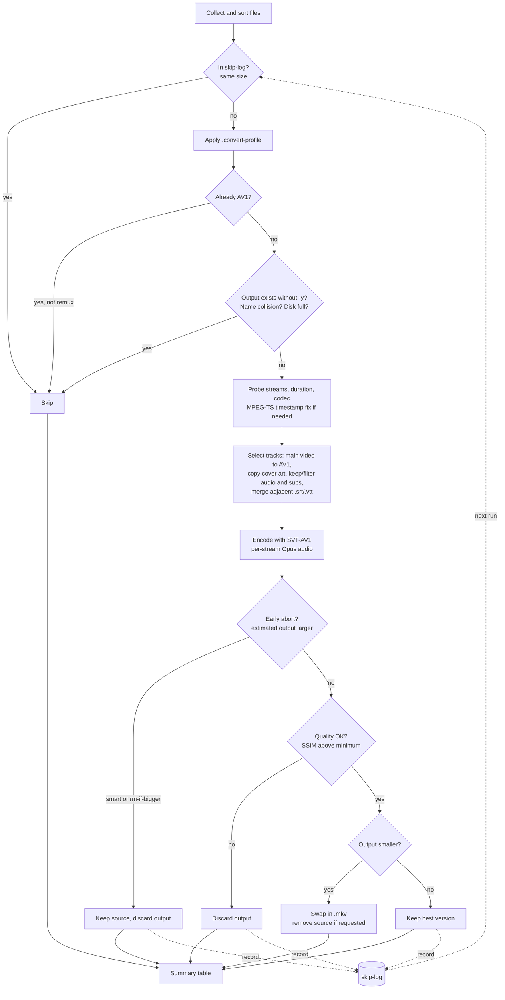

# convert-to-av1

[](https://github.com/janroudaut/convert-to-av1/actions/workflows/ci.yml)

Batch video converter to AV1 using FFmpeg and SVT-AV1. Designed to reduce storage for TV recordings, series, and movies with minimal effort.

## Features

- **In-place conversion** (default) or output to a separate directory
- **MPEG-TS fix** — auto-detects `.ts` containers and applies timestamp correction flags
- **Smart mode** — keeps the best version (source or output) based on file size
- **Early abort** — stops encoding at ~15% if the output is estimated to be larger than the source
- **Subtitle merging** — auto-detects adjacent `.srt`/`.vtt` files (including multi-language) and muxes them into the output MKV
- **Description embedding** — reads adjacent `.txt` files and embeds them as MKV `description` metadata
- **Audio re-encoding** — optional Opus re-encoding with automatic bitrate detection; decided **per stream**, so 5.1/7.1 tracks keep their native channels (no downmix)
- **Language track filtering** — keep only selected audio/subtitle languages (e.g. `fr,en`) to strip unwanted tracks
- **Remux / cleanup mode** — `--copy-streams` strips tracks without re-encoding (fast)
- **Per-directory profiles** — a `.convert-profile` file applies folder-specific flags (e.g. `--movie` for grainy films, `--cartoon` for animation)
- **Cover art safe** — attached_pic covers/thumbnails are preserved (copied), never fed to the encoder
- **HDR safe** — HDR10/HLG colour metadata is detected and carried through to the AV1 stream
- **Output verification** — optional full-decode check (`--verify`) before an output replaces anything
- **Disk-space guard** — a file is skipped up front when the target filesystem can't hold its temp output
- **Resolution scaling** — downscale to 1080p, 720p, or any custom height
- **Recursive mode** — process entire directory trees
- **Sort by size** — process smallest (or largest) files first
- **File filtering** — skip files below a minimum size, exclude by glob pattern
- **Clean progress bar** — real-time progress with speed, ETA, and fps
- **Detailed file info** — shows container, duration, bitrate, streams, and detected external files before each conversion
- **Graceful failures** — one failed file doesn't stop the batch; summary table at the end
- **Lock files** — prevents concurrent conversion of the same file
- **Post-batch command** — run a custom command after the batch completes
- **Batch progress & ETA** — running byte-based estimate of the time left, shown between files
- **Log stats** — `--stats` turns an accumulated `--log` file into a report (totals, throughput, SSIM)
- **NO_COLOR support** — respects the `NO_COLOR` convention (any non-empty value disables colored output)
- **Dry run mode** — preview what would happen without converting
- **Dependency check** — verify all required tools are installed with `--check`

## Requirements

- `ffmpeg` and `ffprobe` (with `libsvtav1` support)
- `python3` (for file info display)
- Standard GNU utils: `awk`, `bc`, `numfmt`, `stat`, `mktemp` (plus `df` for the optional disk-space guard)
- RAM: expect roughly **2–3 GB** while encoding 1080p (more for 4K) — SVT-AV1's
  look-ahead, not the number of audio/subtitle tracks, drives this. Memory is
  bounded and does not grow with clip length.

Verify your setup:

```bash
./convert-to-av1.sh --check
```

## Quick start

```bash
# Convert all videos in current directory (in-place, default settings)
./convert-to-av1.sh .

# Convert a single file
./convert-to-av1.sh video.mp4

# Smart mode: keep best version, remove source if smaller, abort early if not worth it
./convert-to-av1.sh --smart .

# Recursively convert an entire series folder
./convert-to-av1.sh --smart -r /path/to/series/

# Convert to a separate output directory
./convert-to-av1.sh -o /path/to/output/ *.ts

# Fast encoding for quick results
./convert-to-av1.sh --fast .

# High quality encoding
./convert-to-av1.sh --hq .

# Keep only French and English audio + subtitles (drop the rest)
./convert-to-av1.sh --smart --langs fr,en -r /path/to/series/

# Just clean up an existing file: strip unwanted tracks, no re-encoding
./convert-to-av1.sh --copy-streams --langs fr,en video.mkv

# Preview what would be done
./convert-to-av1.sh --dry-run --sort-by-size .
```

## Usage

```
convert-to-av1 [options] FILES[...]
```

### Output

| Flag | Description |
|------|-------------|
| `-o, --output-dir DIR` | Store converted files in DIR (auto-created) |
| `--in-place` | Convert and replace in-place (default when no `-o`) |

### File management

| Flag | Description |
|------|-------------|
| `--smart, --keep-best-version` | Combines `--rm-src` + `--rm-if-bigger` + `--quality-check`; keeps the best version |
| `--rm-source, --rm-src` | Remove source if output is smaller |
| `--rm-if-bigger` | Remove output if it's larger than source |
| `-y, --overwrite` | Overwrite an existing output file (default: skip it, so re-running a batch resumes where it left off) |

Two safety guards run before each conversion: an **existing output** is skipped unless `-y` is given (in-place `.mkv` → `.mkv` replacement is always allowed — the target *is* the source), and two sources mapping to the **same output name** (`foo.mp4` + `foo.avi`, or same-named files from different subdirs with `-o`) are detected — the first one wins, the rest are skipped with a warning.

### Quality

| Flag | Description |
|------|-------------|
| `--max-res, --max-h HEIGHT` | Scale down to HEIGHT px if source is taller |
| `--1080, --1080p` | Alias for `--max-res 1080` |
| `--720, --720p` | Alias for `--max-res 720` |
| `--sd, --fast` | Fast encoding (preset 10, CRF 32) |
| `--hq` | High quality (preset 4, CRF 28, film-grain 8) |
| `--cartoon` | Optimised for animation (no grain, higher CRF) |
| `--tv` | Optimised for TV/broadcasts (no grain, faster preset) |
| `--movie` | Optimised for cinema (film-grain + denoise, lower CRF) |
| `--crf N` | Set the CRF directly (0–63, lower = better quality) |
| `--preset N` | Set the SVT-AV1 preset directly (0–13, lower = slower/better) |
| `--verify` | Fully decode each output before accepting it (catches corrupt bitstreams; costs one extra decode). Outputs under `--min-size` are always verified — a decode that small is free, and it proves a suspiciously tiny file is real video, not garbage |

**HDR is preserved:** HDR10 (`smpte2084`/PQ) and HLG sources are detected from the probe and their colour metadata (transfer, primaries, matrix) is carried through to the AV1 stream — an untagged HDR encode would play back washed-out. SDR sources with invalid or missing colour metadata still get the BT.709 fix SVT-AV1 requires.

Speed presets (`--fast`, default, `--hq`) and content presets (`--cartoon`, `--tv`, `--movie`) are combinable in any order: `--fast --cartoon`, `--hq --movie`, etc. An explicit `--crf`/`--preset` always wins over whatever the presets would derive (e.g. `--movie --crf 30` encodes at CRF 30, not 28), and both are usable in `.convert-profile` files for per-folder fine-tuning.

Default: preset 8, CRF 28, 10-bit, no film-grain.

#### Preset matrix

| | `--fast` | default | `--hq` |
|---|---|---|---|
| *(none)* | p10 crf32 | p8 crf28 | p4 crf28 grain=8 |
| `--cartoon` | p10 crf34 | p8 crf30 | p4 crf30 |
| `--tv` | p10 crf33 | p10 crf29 | p10 crf29 |
| `--movie` | p10 crf30 grain=8 denoise | p8 crf26 grain=10 denoise | p4 crf26 grain=10 denoise |

All presets use 10-bit encoding, enable-overlays, and scene-change detection. Film-grain synthesis is only enabled for `--hq` (alone) and `--movie` — it improves perceived quality for film content but has a significant performance cost (~3.5x slower). `--movie` also enables `film-grain-denoise` to preserve and re-synthesize grain from the source.

### Batch

| Flag | Description |
|------|-------------|
| `-r, --recursive` | Recurse into subdirectories |
| `--sort-by-size [asc\|desc]` | Sort files by size before processing (default: desc) |
| `--min-size SIZE` | Minimum plausible video size (default: `128K`; `0` disables). One threshold, three guards: smaller inputs are skipped, smaller outputs are decode-verified, and an output under `min(SIZE, input/10)` is flagged corrupt |
| `--exclude PATTERN` | Exclude files matching glob pattern (repeatable) |
| `--skip-log[=FILE]` | Record files not worth converting and skip them on re-runs |
| `--dry-run` | Preview without converting — shows the same per-file stream table (incl. per-track decisions) as a real run |
| `--no-early-abort` | Disable early abort when output is estimated larger |
| `--early-abort-threshold PCT` | Progress % at which to evaluate (default: 15 — early savings are misleading, real gains often only show past ~10%) |
| `--after CMD` | Run CMD after the batch completes |

**Skip log (`--skip-log`):** when re-converting a directory, files that came out *not worth it* — SSIM below the target, or AV1 larger than the source — are recorded and **skipped on the next run**, so a repeat batch doesn't waste time re-encoding known losers. The log defaults to `.convert-skip.list` at the input root (override with `--skip-log=FILE`); paths are stored relative to it (portable if the tree moves) and a recorded source size means a **changed file is retried**. Each entry keeps the size, source mtime, and reason.

```bash
# First pass logs the duds; later passes skip them instantly
./convert-to-av1.sh --smart -r --skip-log /mnt/x/Series/
```

> **Slow storage (WSL `/mnt`, NAS):** the SSIM quality check does random seeks across multi-GB files, which these mounts handle poorly. For very large files, work from a fast local disk (e.g. rsync to `~/work` on ext4, convert there, copy back).

### Audio

| Flag | Description |
|------|-------------|
| `--copy-audio` | Keep original audio (no re-encoding) |
| `--opus` | Re-encode audio to Opus (conservative bitrates) |
| `--auto-audio` | Re-encode to Opus only if source bitrate exceeds threshold (default) |
| `--audio-threshold KB/S` | Bitrate threshold for `--auto-audio` (default: 200) |

The audio codec is chosen **per stream**: no global channel remapping is applied, so multichannel tracks (5.1/7.1) keep their native channel count — Opus re-encoding never downmixes surround to stereo. Non-standard channel layouts (e.g. `5.1(side)`) are normalised so `libopus` accepts them.

Two more per-track rules:

- **Already-Opus tracks are never re-encoded** (a lossy → lossy generation would only lose quality), whatever the mode.
- **Hidden bitrates are measured, not guessed.** MKV often exposes no per-stream audio bitrate to `ffprobe`; when that happens in auto mode, the script samples ~20s of real packets (demux-only, a single extra `ffprobe` per file covering all audio streams at once, cached) to estimate it — shown as `~256k` in the file header. Without this, a high-bitrate AAC/DTS track would look like 0 kb/s and be wrongly copied.

Note: `--hq` also switches the default audio mode from auto to copy — a max-quality run keeps the original audio untouched unless you ask otherwise.

### Tracks (language filtering)

Keep only tracks in the languages you care about. By default **all tracks are kept**. Filtering is opt-in and identifies tracks by their language tag (accepts 2- or 3-letter codes: `fr` matches `fre`/`fra`, `en` matches `eng`).

| Flag | Description |
|------|-------------|
| `--langs LIST` | Keep only these languages for **both** audio and subtitles (e.g. `fr,en`) |
| `--audio-langs LIST` | Keep only these audio languages |
| `--sub-langs LIST` | Keep only these subtitle languages |
| `--copy-streams, --remux` | Don't re-encode: just remux and keep selected tracks (fast cleanup) |

- **Untagged / `und` tracks are always kept** (safety against dropping audio).
- If no audio track matches, **all audio is kept** and a warning is printed (a file is never left without sound).
- All tracks in a matching language are kept (default, forced, commentary, etc.).
- Video (including cover art), attachments/fonts, chapters, and metadata are always preserved.

`--copy-streams` performs a pure remux (`-c copy`) — no video or audio re-encoding — which is ideal for stripping unwanted tracks from an existing file in seconds. It also works on files that are already AV1 (which normal conversion would skip).

```bash
# Strip everything except French/English audio and subtitles, re-encode video to AV1
./convert-to-av1.sh --langs fr,en video.mkv

# Fine-grained: keep only French audio, but French + English subtitles
./convert-to-av1.sh --audio-langs fr --sub-langs fr,en video.mkv

# Clean an existing file without re-encoding (fast)
./convert-to-av1.sh --copy-streams --langs fr,en video.mkv
```

### Per-directory profiles

Drop a `.convert-profile` file into a directory (or any parent) and its flags are applied to every video under it — so you can set the right profile per content type without passing flags each time. This is more reliable than trying to auto-detect content: you know a folder is animation or grainy film, a heuristic doesn't.

| Flag | Description |
|------|-------------|
| `--no-profile` | Ignore all `.convert-profile` files |

- Resolved **per file**: the tool walks up from each file's directory and uses the first `.convert-profile` it finds.
- One flag per line or space-separated; `#` starts a comment.
- Supports the encoding/quality/audio/track flags (`--movie`, `--cartoon`, `--tv`, `--hq`, `--fast`, `--crf`, `--preset`, `--1080`, `--opus`, `--langs`, `--copy-streams`, …). Batch/output flags (`-o`, `-r`, `--smart`, …) are ignored in profiles.
- Profile flags override the CLI base for that file.

```bash
# /mnt/videos/Movies/Die Hard (1988)/.convert-profile
--movie

# /mnt/videos/Series/South Park/.convert-profile   (applies to all seasons below)
# 2D animation: no grain, a touch higher CRF
--cartoon

# Then just run the batch — each folder gets its own profile automatically:
./convert-to-av1.sh --smart -r /mnt/videos/
```

### Subtitles

| Flag | Description |
|------|-------------|
| `--no-merge-subs` | Don't merge adjacent `.srt`/`.vtt` files into output |

When merging is enabled (default), the script finds all `.srt` and `.vtt` files matching the video filename (e.g., `video.srt`, `video.fr.srt`, `video.en.vtt`) and muxes them as subtitle tracks. Merged subtitle files are deleted when `--rm-source` is active.

Adjacent `.txt` files are embedded as MKV `description` metadata but are **never deleted**.

### Logging

| Flag | Description |
|------|-------------|
| `-l, --log FILE` | Append a synthetic, greppable per-file TSV log to FILE (time, status, sizes, saved %, wall time, note) |
| `--stats FILE` | Summarise a `--log` file and exit: per-status counts, converted totals, encode time/throughput, SSIM min/avg |
| `-v, --verbose` | Verbose output |
| `--no-progress` | Disable progress bar |

### Other

| Flag | Description |
|------|-------------|
| `--check` | Check dependencies and exit |
| `-h, --help` | Show this help |
| `--version` | Show version |

## How it works



1. **Probe** — reads container format, streams, duration, and codec info
2. **Skip** — skip files already in AV1 (unless `--copy-streams`, which can still clean them), and files recorded in the skip-log from a previous run (`--skip-log`)
3. **MPEG-TS fix** — if the container is MPEG-TS, applies `-fflags +genpts+igndts -avoid_negative_ts make_zero`
4. **Merge** — detects and includes adjacent subtitle/description files
5. **Select tracks** — keeps all streams by default, or filters audio/subtitles by language; only the first video stream is encoded to AV1 while cover-art/thumbnail streams are copied verbatim
6. **Encode** — runs FFmpeg with SVT-AV1 (per-stream audio codec), piping progress to a real-time monitor
7. **Early abort** — at the configured threshold (default 15%), estimates final output size; aborts if it would be larger than input (only when `--smart` or `--rm-if-bigger`)
8. **Post-process** — handles smart mode logic, source removal, in-place file swap; detects corrupt outputs (below `min(--min-size, input/10)`, plus a full decode — forced for sub-`--min-size` outputs, everywhere with `--verify`)
9. **Summary** — prints a table of all results with sizes and savings

## Example output

Per-file, while converting (here with `--langs fr,en`, so only French/English tracks are kept).
Each stream shows, colour-coded, what will happen to it: `↻ av1`/`↻ opus` re-encode, `✓ copy` kept as-is, `✗ skip` dropped.

The main video stream is always listed first (then audio, subtitles, covers), whatever the container's stream order. A `~` before an audio bitrate means it was measured from real packets because the container didn't report one. During a batch, a progress line (files done, space saved, estimated time left) appears above each file.

```
batch: 4/12 done | saved 11.2G | ~02:41:05 left

▸ [5/12] S01E05 - Got Milk.mkv   7.2G
  video     ↻ av1    hevc       1920×1080    22287k    56m28s @ 23.98fps (matroska)
  audio     ↻ opus   eac3       5.1          768k      [eng]
  audio     ↻ opus   aac        5.1          ~641k     [fre]
  audio     ✗ skip   eac3       5.1          768k      [ger]
  subtitle  ✓ copy   subrip                            [fre]
  subtitle  ✓ copy   subrip                            [eng]
  → S01E05 - Got Milk.mkv
  [ 45%] [#############-----------------] 00:25:24/00:56:28 | fps: 42.1 1.9x | ETA: 00:16:20 | 2870kb/s saved=61%
  Conversion done in 00:29:42 (avg 45.6 fps, 1.9x).
  saved=4.4G (61%): 7.2G -> 2.8G
```

End-of-batch summary table:

```
File                                               Status          Input     Output    Saved  Note
-------------------------------------------------- ---------- ---------- ---------- --------  ----
S01E05 - Got Milk.mkv                              OK               7.2G       2.8G      61%  saved 61% (4.4G)
already_av1.mkv                                    SKIPPED          500M        ---      ---  already AV1
broken_file.avi                                    FAILED           200M        ---      ---  ffmpeg exit 1

Total: 7.9G -> 2.8G | saved=5.1G (65%)
OK: 1 | Skip: 1 | Abort: 0 | Fail: 1 | Total: 3 | elapsed: 00:48:12
```

With `--log FILE`, each file also gets one synthetic, tab-separated line (no colours, no
progress bar) — easy to `grep`/`awk`/sort across runs. Each session opens with a commented
header (written before the first encode, so the log is `tail -f`-able from the start):

```
# ── session 2026-07-12T21:14:01+02:00 — convert-to-av1 v3.4.0
# output: in-place | encoder: SVT-AV1 preset=8 crf=28 10-bit grain=off | audio: auto > 200 kb/s
# flags: smart, rm-source, quality-check>=0.92 | early-abort: 15%
# files: 3 queued (7.9G)
2026-07-12T21:14:03+02:00  OK        in=7.2G  out=2.8G  saved=61%  took=00:29:42  saved 61% (4.4G) ssim=0.973214  S01E05 - Got Milk.mkv
2026-07-12T21:14:05+02:00  SKIPPED   in=500M  out=-     saved=-    took=-         already AV1        already_av1.mkv
2026-07-12T22:02:20+02:00  FAILED    in=200M  out=-     saved=-    took=-         ffmpeg exit 1      broken_file.avi
```

When `--quality-check` is active, the measured SSIM of each successful encode is recorded in the note (`ssim=…`) — handy for calibrating `--min-ssim` across a library after the fact. Files converted under a `.convert-profile` carry its flags in their log line (e.g. `[--cartoon]`), so the effective per-file settings are always reconstructible: CLI-level config from the session header, profile overrides from the file's own line.

`--stats` turns that accumulated log into a report:

```
$ ./convert-to-av1.sh --stats convert.log
convert-to-av1 v3.4.0 — stats for convert.log

  OK         42
  SKIPPED    10
  FAILED     2
  total      54

  converted ......... 312.4G -> 141.9G (saved 170.5G, 54%)
  encode time ....... 37h12m total, avg 53m/file, 2.4 MB/s
  ssim .............. min 0.9231, avg 0.9612 (42 checked)
```

## Supported formats

Input: `mp4`, `mkv`, `avi`, `mov`, `wmv`, `flv`, `ts`, `m2ts`, `mts`, `m4v`, `webm`, `mpg`, `mpeg`

Output: MKV (Matroska) — chosen for its broad codec and subtitle support.

## Acknowledgements

First and foremost, to the **FFmpeg** developers, and to the **assembly masters**
whose hand-written SIMD makes real-time video possible — the people optimizing
dav1d, SVT-AV1, x264/x265 and countless codecs one instruction at a time. This
tool is just a shell script standing on those giants' shoulders.

```
virtualdub-grade artistry: not found.
bytes shaved: yes. verdict: watchable.
with respect to those who did it properly.
```

## License

[WTFPL](http://www.wtfpl.net/) — Do What The Fuck You Want To Public License. See `LICENSE`.
